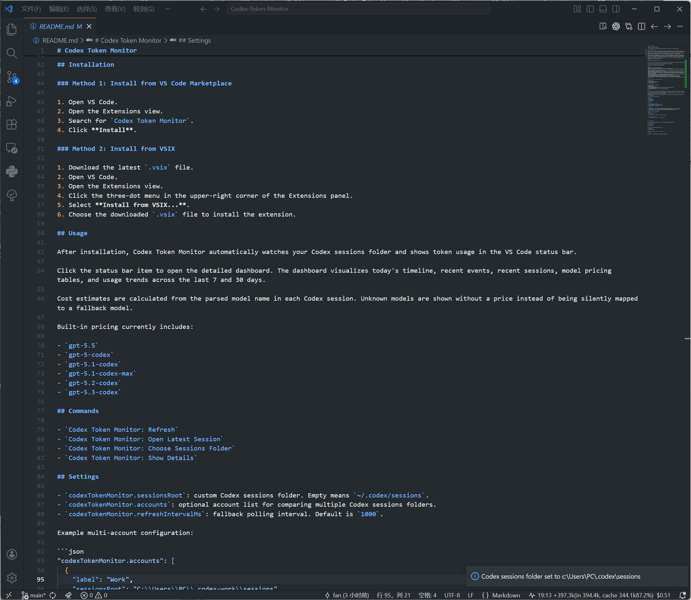

# Codex Token Monitor

Language: [CN](./README.zh-CN.md)

A VS Code extension for real-time monitoring, pricing, and visualization of Codex token usage.

## Why this project exists

The goal of this project is to make token usage visible while working with Codex. A common misconception is that giving an AI model more context always makes it smarter. In practice, the opposite can happen: too much context may reduce accuracy, increase noise, and consume far more tokens.

I wanted a way to understand the token cost of each conversation turn in real time, including total usage and cache hit rate, so I could ask more efficient questions, improve answer quality, and reduce unnecessary consumption of my limited quota.

Codex's official quota percentage is useful, but it is not detailed enough for this workflow. The ccusage project showed that Codex token usage can be read directly from local JSONL session files. However, ccusage is not designed to monitor every token event in real time inside VS Code. This extension was built to fill that gap: it provides immediate feedback on token usage so each prompt can become more intentional, efficient, and cost-aware.

Codex Token Monitor watches your Codex JSONL session files, reads `event_msg` entries whose payload type is `token_count`, and displays the latest token usage directly in the VS Code status bar.

```text
18:41  +56k(in 54.6k, cache 50k, 91%)  $0.12
```

The status bar shows the latest session turn, including total tokens, input tokens, cached input tokens, cache hit percentage, and estimated session cost.

Click the status bar token usage item to open the detailed visual dashboard.



## Features

- Monitors `~/.codex/sessions` by default.
- Supports nested Codex session folders, such as `sessions/2026/04/30/*.jsonl`.
- Shows the latest session turn in the VS Code status bar, including total tokens, input tokens, cached input tokens, cache hit percentage, and estimated cost.
- Uses ccusage-compatible accounting: each `token_count` event is treated as a cumulative total, and usage is calculated from the positive delta between consecutive cumulative events in the same session file.
- Avoids double-counting repeated `token_count` events because repeated cumulative totals produce a zero delta.
- Estimates cost from the actual model IDs found in Codex session logs, with separate rates for uncached input, cached input, output, and fast mode.
- Opens a visual dashboard from the status bar, including today's token timeline, 7-day usage, 30-day usage, recent sessions, detailed event records, and model pricing breakdowns.
- Supports account filtering. You can configure multiple accounts by mapping account labels to different Codex session folders.
- Links Today Timeline points with matching Today Events table rows on hover.
- Draws hollow prompt/session rings on the Today Timeline and links them to Recent Sessions rows.
- Adds cost columns to Today Events and Recent Sessions. Hover a cost value to see the calculation.
- Includes commands for refreshing data, opening the latest session, showing details, and selecting a custom sessions folder.

## Installation

### Method 1: Install from VS Code Marketplace

1. Open VS Code.
2. Open the Extensions view.
3. Search for `Codex Token Monitor`.
4. Click **Install**.

### Method 2: Install from VSIX

1. Download the latest `.vsix` file.
2. Open VS Code.
3. Open the Extensions view.
4. Click the three-dot menu in the upper-right corner of the Extensions panel.
5. Select **Install from VSIX...**.
6. Choose the downloaded `.vsix` file to install the extension.

## Usage

After installation, Codex Token Monitor automatically watches your Codex sessions folder and shows token usage in the VS Code status bar.

Click the status bar item to open the detailed dashboard. The dashboard visualizes today's timeline, recent events, recent sessions, model pricing tables, and usage trends across the last 7 and 30 days.

Cost estimates are calculated from the parsed model name in each Codex session. Unknown models are shown without a price instead of being silently mapped to a fallback model.

Built-in pricing currently includes:

- `gpt-5.5`
- `gpt-5-codex`
- `gpt-5.1-codex`
- `gpt-5.1-codex-max`
- `gpt-5.2-codex`
- `gpt-5.3-codex`

## Commands

- `Codex Token Monitor: Refresh`
- `Codex Token Monitor: Open Latest Session`
- `Codex Token Monitor: Choose Sessions Folder`
- `Codex Token Monitor: Show Details`

## Settings

- `codexTokenMonitor.sessionsRoot`: custom Codex sessions folder. Empty means `~/.codex/sessions`.
- `codexTokenMonitor.accounts`: optional account list for comparing multiple Codex sessions folders.
- `codexTokenMonitor.refreshIntervalMs`: fallback polling interval. Default is `1000`.

Example multi-account configuration:

```json
"codexTokenMonitor.accounts": [
  {
    "label": "Work",
    "sessionsRoot": "C:\\Users\\PC\\.codex-work\\sessions"
  },
  {
    "label": "Personal",
    "sessionsRoot": "C:\\Users\\PC\\.codex\\sessions"
  }
]
```

## Local Development

Open this folder in VS Code and press `F5` to launch an Extension Development Host.

To run syntax checks:

```powershell
npm.cmd run check
```

To create a local VSIX without installing `vsce`:

```powershell
npm.cmd run package
```

The VSIX will be written to the `dist/` folder.

## License

This project is licensed under the [MIT License](./LICENSE).
