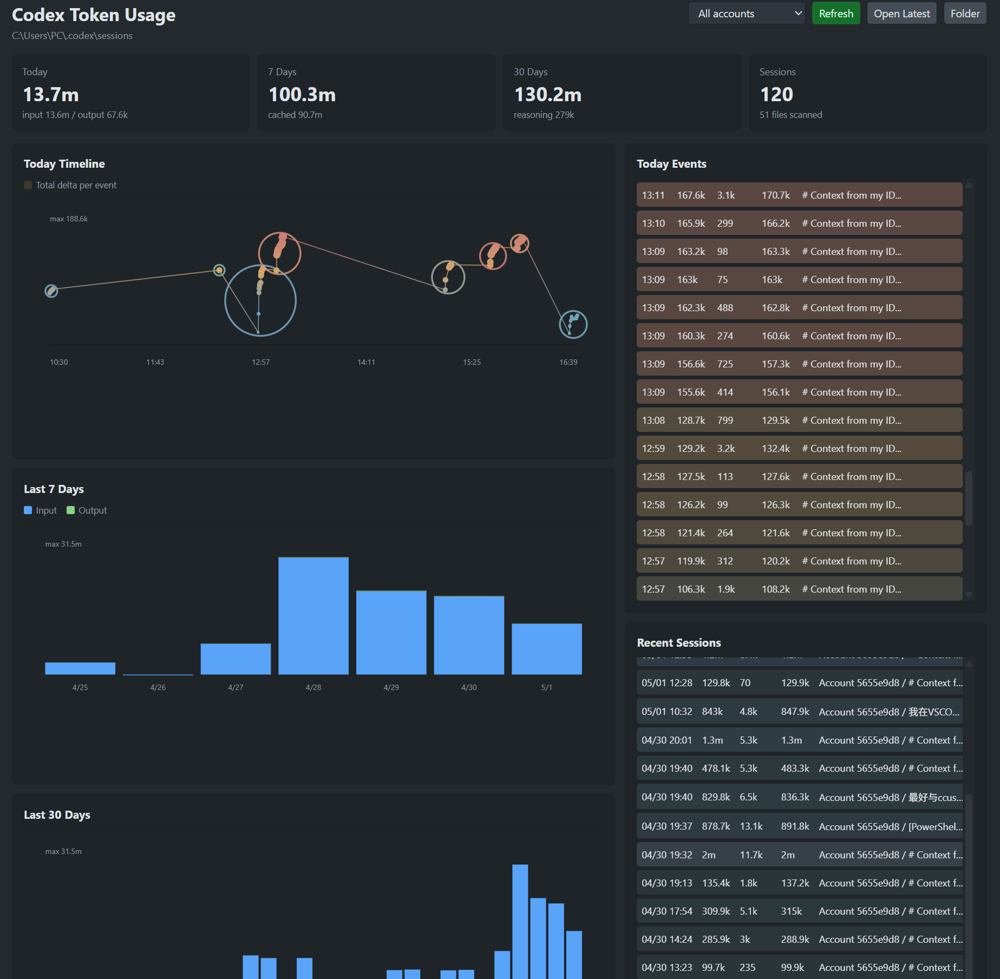

# Codex Token Monitor

A VS Code extension for real-time monitoring and visualization of Codex token usage.

Codex Token Monitor watches your Codex JSONL session files, reads `event_msg` entries whose payload type is `token_count`, and displays the latest token usage directly in the VS Code status bar.

```text
19:32  +320 (in:200 / out:120)  today:12.4k
```

Click the status bar token usage item to open the detailed visual dashboard.



## Features

- Monitors `~/.codex/sessions` by default.
- Supports nested Codex session folders, such as `sessions/2026/04/30/*.jsonl`.
- Shows the latest request token delta, input tokens, output tokens, and today's total usage in the VS Code status bar.
- Uses ccusage-compatible accounting: each `token_count` event is treated as a cumulative total, and usage is calculated from the positive delta between consecutive cumulative events in the same session file.
- Avoids double-counting repeated `token_count` events because repeated cumulative totals produce a zero delta.
- Opens a visual dashboard from the status bar, including today's token timeline, 7-day usage, 30-day usage, recent sessions, and detailed event records.
- Supports account filtering. You can configure multiple accounts by mapping account labels to different Codex session folders.
- Links Today Timeline points with matching Today Events table rows on hover.
- Draws hollow prompt/session rings on the Today Timeline and links them to Recent Sessions rows.
- Includes commands for refreshing data, opening the latest session, showing details, and selecting a custom sessions folder.

## Installation

### Method 1: Install from VS Code Marketplace

1. Open VS Code.
2. Open the Extensions view.
3. Search for `Codex Token Monitor`.
4. Click **Install**.

### Method 2: Install from VSIX

1. Download the latest `.vsix` file.
2. Open VS Code.
3. Open the Extensions view.
4. Click the three-dot menu in the upper-right corner of the Extensions panel.
5. Select **Install from VSIX...**.
6. Choose the downloaded `.vsix` file to install the extension.

## Usage

After installation, Codex Token Monitor automatically watches your Codex sessions folder and shows token usage in the VS Code status bar.

Click the status bar item to open the detailed dashboard. The dashboard visualizes today's timeline, recent events, recent sessions, and usage trends across the last 7 and 30 days.

## Commands

- `Codex Token Monitor: Refresh`
- `Codex Token Monitor: Open Latest Session`
- `Codex Token Monitor: Choose Sessions Folder`
- `Codex Token Monitor: Show Details`

## Settings

- `codexTokenMonitor.sessionsRoot`: custom Codex sessions folder. Empty means `~/.codex/sessions`.
- `codexTokenMonitor.accounts`: optional account list for comparing multiple Codex sessions folders.
- `codexTokenMonitor.refreshIntervalMs`: fallback polling interval. Default is `1000`.

Example multi-account configuration:

```json
"codexTokenMonitor.accounts": [
  {
    "label": "Work",
    "sessionsRoot": "C:\\Users\\PC\\.codex-work\\sessions"
  },
  {
    "label": "Personal",
    "sessionsRoot": "C:\\Users\\PC\\.codex\\sessions"
  }
]
```

## Local Development

Open this folder in VS Code and press `F5` to launch an Extension Development Host.

To run syntax checks:

```powershell
npm.cmd run check
```

To create a local VSIX without installing `vsce`:

```powershell
npm.cmd run package
```

The VSIX will be written to the `dist/` folder.
